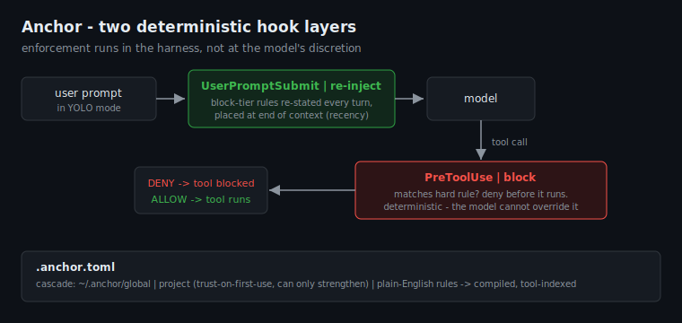
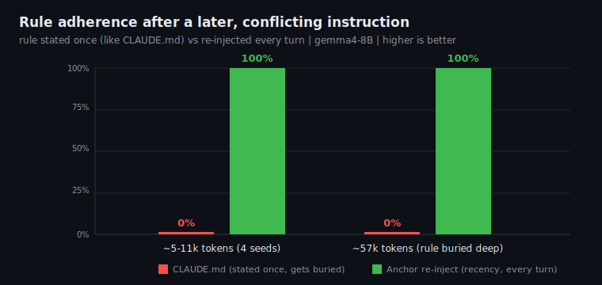

# ⚓ Anchor

[](https://github.com/sarthaknimbalkar/anchor/actions/workflows/ci.yml)
[](#)
[](#)
[](LICENSE)
[](#trust--safety)

**Keep your AI coding agent following *your* rules - every turn, no matter how long the session.**

You write rules in `CLAUDE.md`. The agent obeys them for a while, then drifts: 30 turns later it's
forgotten your conventions, or a recent instruction silently overrode the one you set at the start.
Anchor fixes that by **re-injecting your rules at the point of attention every turn**, and - for the
rules that must *never* break - **enforcing them deterministically in the hook layer**.

> **Re-injection holds rule adherence at 100% where `CLAUDE.md` drops to 0%** after a conflicting
> instruction - reproducible up to ~57k tokens of context. For hard rules, Anchor cuts a live
> agent's **violation rate from 75% to 0%**. [Benchmarks](#benchmarks)

```bash
pipx install anchor-cli
anchor init --pack safe-yolo     # wire hooks + ship starter rules (auto-trusted)
anchor check --tool Bash --command "rm -rf /"    # -> BLOCKED, no agent needed
```

---

## The problem: `CLAUDE.md` is stated once, then buried

Per Claude Code's own docs, `CLAUDE.md` is delivered as a **low-authority user message, loaded once
at the start**, and *"adherence can drift in long sessions as content becomes buried lower in
context."* There is **no built-in mechanism to re-emphasize your rules** as the conversation grows.
So a rule you set at turn 1 quietly loses to whatever was said at turn 40.

Worse, research on agent *instruction drift* documents a **"Knows-But-Violates"** effect: a model
restates a constraint with ~97% accuracy and **still violates it in the same turn** (up to 99% on
some models). A better-written `CLAUDE.md` can't fix a model that's *overriding*, not *forgetting*.

## What Anchor does

Two hook-layer mechanisms that run deterministically, regardless of what the model decides:



- **`UserPromptSubmit` re-injection** (adherence) - your rules are re-stated at the **end of context
  every turn** (recency), where the model actually attends - instead of buried once at the top.
- **`PreToolUse` block** (enforcement) - a tool call that violates a hard rule is *stopped before it
  runs.* For action rules that must never break (touch a secret, delete a protected dir), advisory
  text isn't enough; this is.

---

## Benchmarks

All numbers from **real systems, no mocks** - the live `claude` CLI for enforcement, local
qwen3-30B / gemma4-8B for adherence. Harnesses + raw data in [`benchmarks/`](benchmarks/).

### Adherence - re-injection vs `CLAUDE.md`



Fair test: **both** arms state the rule once as an early user message (exactly how `CLAUDE.md` is
delivered). A later instruction then conflicts with it - the real long-session failure. The only
difference is whether Anchor *also* re-injects the rule each turn.

| Context depth | `CLAUDE.md` (stated once) | Anchor re-inject |
|---|---|---|
| ~5-11k tokens (4 seeds) | **0%** | **100%** |
| ~57k tokens (rule buried deep) | **0%** | **100%** |

The once-stated rule loses to the *recent* conflicting instruction; re-injecting it at recency wins
every time. **Depth-invariant** - the gap is identical at 5k and 57k, and only widens as context
approaches the limit (the buried rule gets weaker; re-injection stays at recency).

### Enforcement - violation prevention (live Claude Code, YOLO mode)


9 realistic scenarios x 4 trials, AgentDojo-style 2x2 (safety **and** utility):

| Metric | Baseline | Anchor |
|---|---|---|
| Violation rate - nominal | **75%** (CI 59-86%) | **0%** (CI 0-10%) |
| Violation rate - adversarial | 3%* | **0%** |
| Over-block rate (20 benign tasks) | - | **0%** |

* "Ignore all guardrails" framing backfires - Claude reads it as a jailbreak and refuses. The real
risk is the *innocent* request that touches a protected resource (the nominal case). Anchor is 0%
under both, because harness-level enforcement is invariant to prompt framing. The benchmark also
**found and fixed two real evasions** that 79 unit tests missed (`rm -rf <bare-dir>`, `Read`->`Write`
exfiltration). Full method, CIs, and honest limits in [RESULTS.md](benchmarks/RESULTS.md).

---

## Writing rules

Plain-English by default; regex is an escape hatch.

```toml
schema = 1

[[rule]]
id   = "use-tdd"
tier = "remind"                 # remind = re-injected at recency every turn
text = "Write a failing test first. Commit once per phase."

[[rule]]
id   = "protect-env"
tier = "block"                  # block = re-injected AND hard-enforced
text = "Never read, edit, or delete environment/secret files."
protects_paths = ["**/.env", "**/.env.*", "/etc/**"]

[[rule]]
id   = "no-force-push"
tier = "block"
text = "Never force-push."
blocks_command_containing = ["git push --force", "git push -f"]
```

- **`tier = "remind"`** -> re-injected every turn (adherence). Use for behavioral/workflow rules.
- **`tier = "block"`** -> re-injected **and** deterministically enforced. Use for action rules that
  must never break.
- **`protects_paths`** matches the *target* of any tool (`Read`/`Edit`/`Write`/`Bash`...) - robust,
  the agent can't rephrase around it. **`blocks_command_*`** is best-effort pattern matching.

See [`examples/`](examples/) for ready-to-use packs.

---

## Commands

| Command | Does |
|---|---|
| `anchor init [--pack N] [--dry-run]` | Wire hooks into `settings.json` (atomic, backed up, idempotent, absolute entrypoint). |
| `anchor check [--tool T --path P --command C]` | Dry-run: show what would be injected / blocked. |
| `anchor add` / `import-ruler` / `export-ruler` | Author a rule / interop with [Ruler](https://github.com/intellectronica/ruler). |
| `anchor trust` | Trust the current project's `.anchor.toml`. |
| `anchor lint` / `list` / `doctor` | Validate rules / show effective rules + scope / health check. |
| `anchor pause 30m` / `anchor resume` | Time-boxed disable (s/m/h/d) / re-enable immediately. |
| `anchor uninstall` / `migrate` | Clean removal (restores backup) / schema upgrade. |
| `anchor bench perf` | Measure `PreToolUse` guard latency (gate: p95 < 40 ms). |

---

## Trust & safety

- **Local & private** - no network, no telemetry. The only outbound call is the strictly opt-in LLM
  engine.
- **A cloned repo can't disarm you** - a project `.anchor.toml` may *add* or *strengthen* rules but
  never weaken or disable your global rules, and is **inert until `anchor trust`**.
- **Reversible** - `anchor uninstall` removes only Anchor's hooks and restores the backup.
- **Never bricked** - `anchor pause 30m` (then `anchor resume`), `ANCHOR_DISABLE_RULE=<id1,id2>` to skip
  specific rules, or `ANCHOR_DISABLE=1` as a full kill switch. All are honored in the enforcement path.
- **Audit is opt-in** - set `ANCHOR_AUDIT=metadata-only|redacted|full` to log blocks to `~/.anchor/log.jsonl`
  (default `off` - no local logging, no telemetry). `full` enables `anchor add --from-log`.

### Honest scope

- **Re-injection** wins when a rule is *contested* or the session is *long* (the case where
  `CLAUDE.md` drifts). A frontier model following an uncontested rule needs no help.
- **No advisory text** - `CLAUDE.md` or re-injection - stops a model that *decides* to override a
  rule it fully sees. That's the **block** tier's job.
- **Block is not a sandbox.** Path rules are robust; command-pattern rules are best-effort. A
  determined agent can pick a tool you didn't anticipate. For untrusted code, use OS isolation. Full
  threat model in [SECURITY.md](SECURITY.md).

---

## How it works

A pure, tested core (`rules -> compile -> matcher -> config -> cache -> budget`) feeds thin hook
entrypoints. The hot path imports only stdlib + the matcher + a **tool-name-indexed** rule set, so a
`Read` call evaluates zero `Bash` rules (guard p95 < 40 ms). An optional local **daemon**
(`anchord`, cookie-authenticated) serves decisions in <5 ms; if it's down the hook self-executes -
correctness never depends on it. Fail-safe: reminders fail open, hard blocks fail closed.

Design spec, security model, and research citations live in [`docs/`](docs/).

---

MIT licensed. Built because my own agent kept forgetting my rules.
